# POSTER++ for Infant Facial Expression Recognition (TIF-DB, 18-fold LOSO-CV)

> **Final Year Project** — Infant Facial Expression Recognition for Baby Monitoring (for Postpartum Mothers with Mental Health Disorders)  
> Universiti Kebangsaan Malaysia (UKM), 2026

This repository contains the implementation for adapting **[POSTER++](https://github.com/Talented-Q/POSTER_V2)** to **infant facial expression recognition (IFER)** on the [Tromsø Infant Faces Database (TIF-DB)](https://doi.org/10.3389/fpsyg.2017.00409), with systematic ablation studies investigating the adult-infant domain gap across model architecture, training strategy, landmark backbone, layer-wise feature transfer, GradCAM interpretability, and geometric feature fusion.

---

## Key Findings

- **POSTER++ consistently outperforms SCN** in both accuracy and generalization stability under 18-fold LOSO-CV small-sample conditions
- **Focal Loss + reduced batch size** (Exp02) yields the largest single-step gain: +6.51% mean accuracy, +0.1315 Macro F1
- **RAF-DB pretraining** (Exp04) achieves best overall performance (78.20% mean acc, Macro F1 = 0.7121), but introduces negative transfer for Disgust→Sad
- **HRNet-R90JT** landmark backbone improves over MobileFaceNet by up to +6.13%, confirmed by GradCAM centroid analysis showing restored attention-prediction correspondence
- **Selective layer freezing** (body1 frozen, LW-2) achieves 78.76% — better than fully unfrozen — showing low-level features transfer well across adult-infant domains
- **Geometric feature fusion** fails to surpass the non-fusion baseline under TIF-DB's small-sample constraints, indicating data scarcity as the primary bottleneck
- **Infant vs adult misclassification divergence** is most pronounced for Fear (d=0.733) and Anger (d=0.648), driven by physiological differences in infant facial muscle development

---

## Dataset

**Tromsø Infant Faces Database (TIF-DB)** — Maack et al. (2017), UiT Arctic University of Norway

- 130 usable images (1 duplicate removed from original 131)
- 18 Caucasian infants, aged 4–12 months, 7 emotion classes

| Happy | Sad | Neutral | Disgust | Surprise | Anger | Fear |
|:---:|:---:|:---:|:---:|:---:|:---:|:---:|
| 33 (25%) | 27 (21%) | 27 (21%) | 14 (11%) | 13 (10%) | 8 (6%) | 8 (6%) |

Evaluation: **18-fold Leave-One-Subject-Out Cross-Validation (LOSO-CV)**

---

## Experimental Results

### 1. Primary Configurations: POSTER++ vs SCN (Exp01–06)

| Exp | Model | Configuration | Mean Acc (%) | Aggregated Acc (%) | Macro F1 |
|-----|-------|--------------|:---:|:---:|:---:|
| 01 | POSTER++ | Baseline (CrossEntropy, bs=64) | 70.77 | 70.77 | 0.5356 |
| 02 | POSTER++ | Focal Loss + bs=16 | 77.28 | 76.92 | 0.6671 |
| 03 | SCN | Baseline (ResNet18_msceleb) | 71.40 | 60.00 | 0.4246 |
| 04 | POSTER++ | RAF-DB pretrained | **78.20** | **77.69** | **0.7121** |
| 05 | SCN | RAF-DB pretrained | 74.10 | 63.08 | 0.5103 |
| 06 | POSTER++ | Full backbone frozen | 32.77 | 32.31 | — |

> SCN shows >11pp gap between mean fold and aggregated accuracy, revealing systematic majority-class bias under small-sample conditions.

**Confusion matrices (Exp01–06):**

<p align="center">
  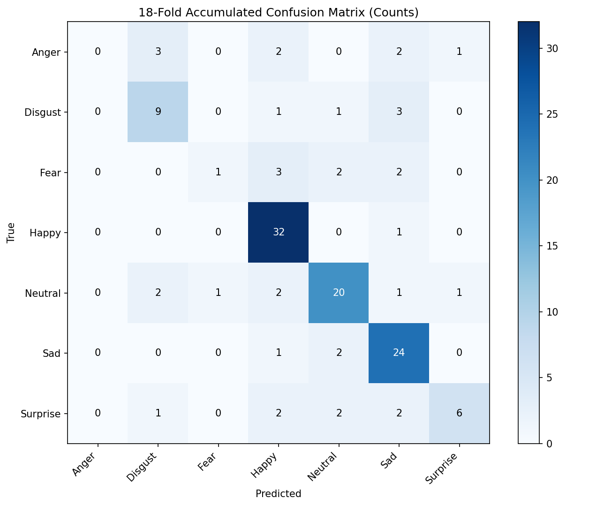
  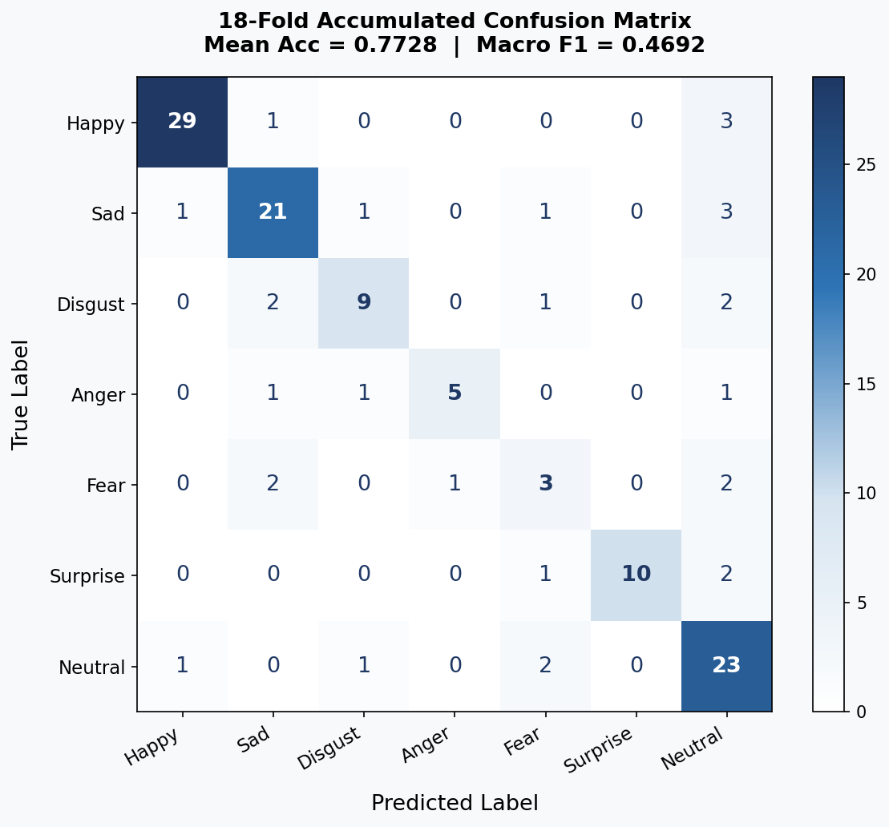
  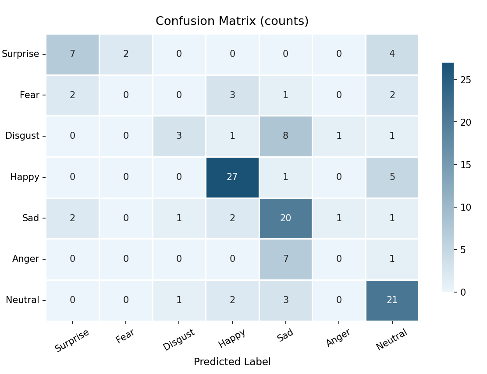
</p>
<p align="center">
  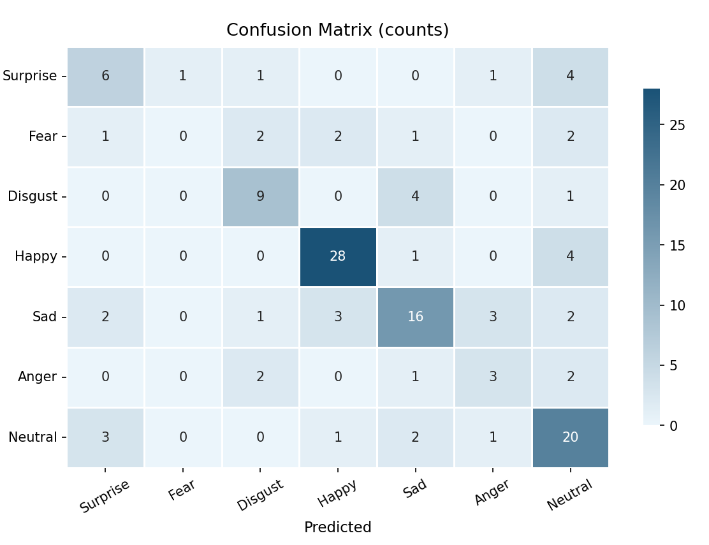
  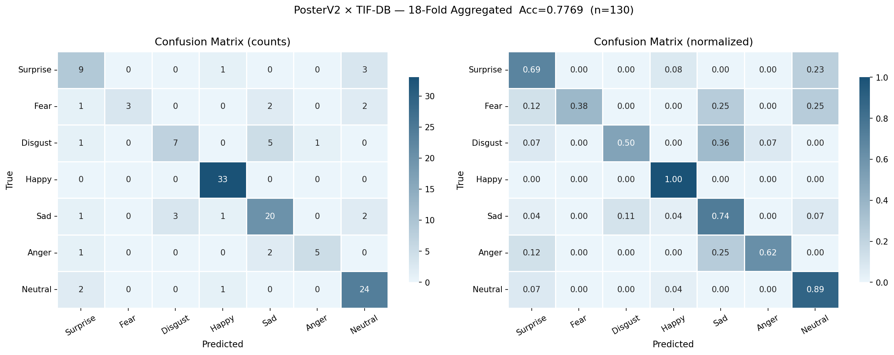
  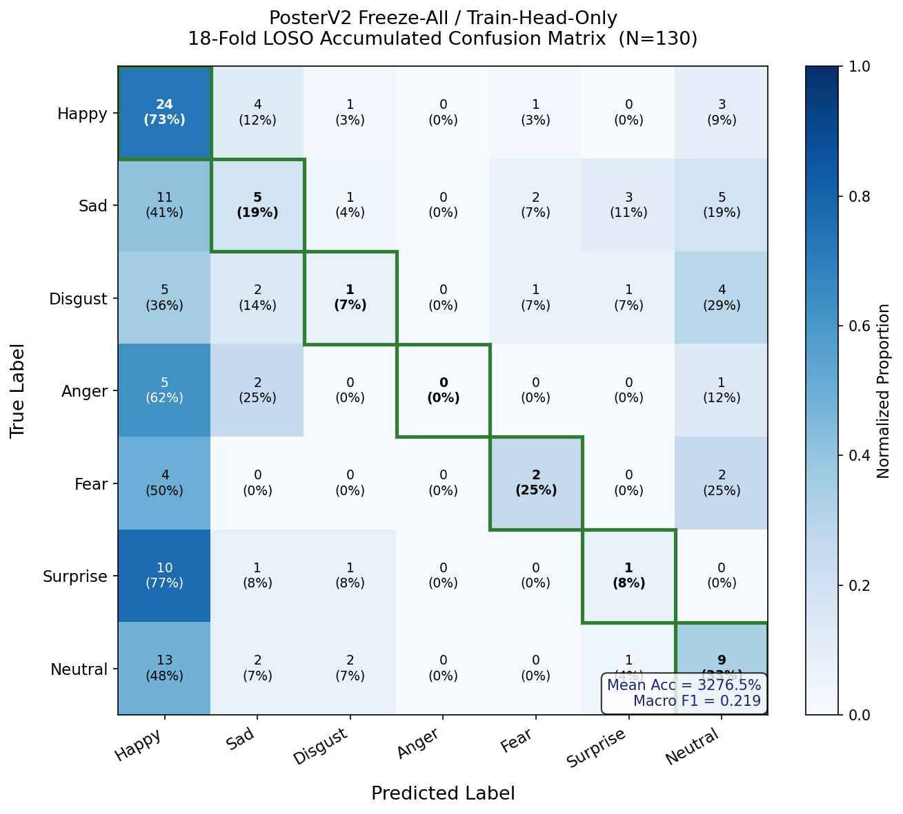
</p>
<p align="center"><em>Top row: Exp01, Exp02, Exp03 &nbsp;|&nbsp; Bottom row: Exp04, Exp05, Exp06</em></p>

---

### 2. Landmark Backbone: MobileFaceNet vs HRNet-R90JT (LM configs)

| Config | Base Exp | Landmark Backbone | Mean Acc (%) | Aggregated Acc (%) |
|--------|----------|-------------------|:---:|:---:|
| LM-1 | Exp01 | MobileFaceNet | 70.77 | 70.77 |
| LM-2 | Exp01 | **HRNet-R90JT** | **76.90** | **76.15** |
| LM-3 | Exp02 | MobileFaceNet | 77.28 | 76.92 |
| LM-4 | Exp02 | **HRNet-R90JT** | **78.99** | **78.46** |
| LM-5 | Exp04 | MobileFaceNet | **78.20** | **77.69** |
| LM-6 | Exp04 | HRNet-R90JT | 77.04 | 76.15 |

MobileFaceNet displaces eye/eyebrow landmarks by **8–11σ** on infant faces (infant eyes at 51.3% vs adult 36.4% of image height).

<p align="center">
  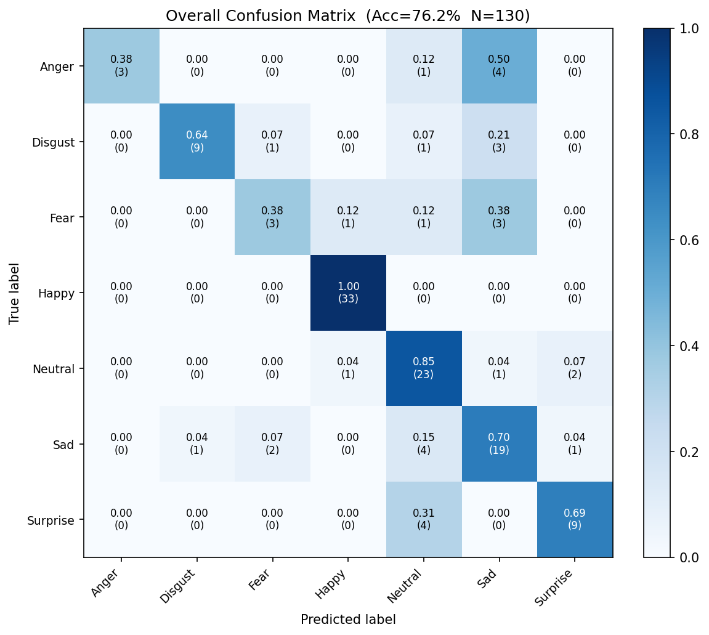
  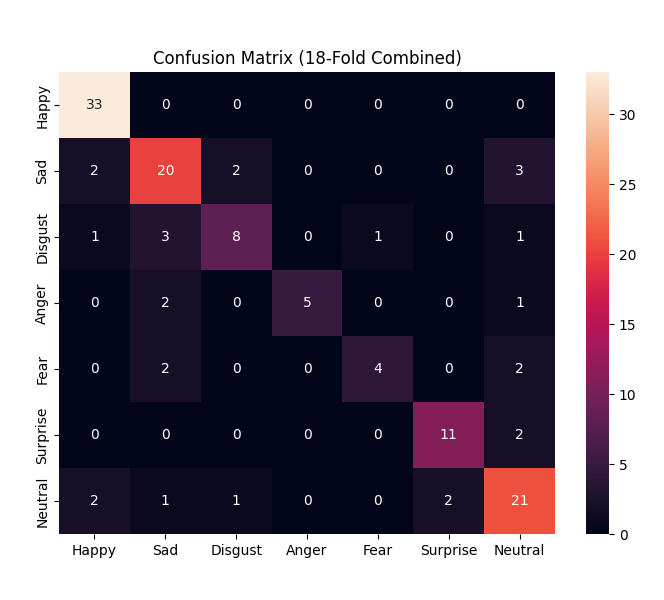
  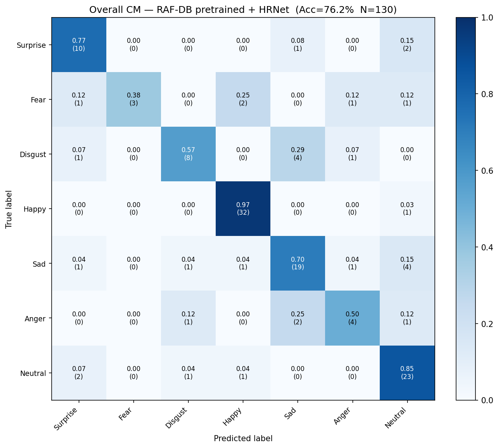
</p>
<p align="center"><em>Confusion matrices: LM-2 (HRNet+Exp01) | LM-4 (HRNet+Exp02) | LM-6 (HRNet+Exp04)</em></p>

**Adult vs Infant facial landmark differences:**

<p align="center">
  
  
</p>
<p align="center">
  
  
</p>

---

### 3. IR50 Layer-wise Unfreezing (LW configs)

| Config | Frozen Layers | Unfrozen Layers | Mean Acc (%) |
|--------|--------------|-----------------|:---:|
| LW-1 | None | All | 70.77 |
| LW-2 | body1 | body2, body3, transformers | **78.76 ± 9.20%** |
| LW-3 | body1, body2 | body3, transformers | 74.57 ± 9.66% |
| LW-4 | body1, body2, transformers | body3 | 74.25 ± 13.35% |

> Freezing only body1 provides implicit regularization while allowing higher-level layers to adapt to infant-specific features. Growing variance with more frozen layers indicates reduced cross-subject adaptability.

---

### 4. GradCAM Interpretability: Config A/B/C/D

Four configurations isolating the effect of landmark backbone and freezing strategy:

| Config | Landmark Backbone | Freezing | Mean Acc (%) | UAR (%) | Macro F1 (%) |
|--------|------------------|----------|:---:|:---:|:---:|
| A | MobileFaceNet | Freeze body1 | 77.40 ± 12.34% | 62.41 | 64.79 |
| B | HRNet-R90JT | Freeze body1 | 78.02 ± 12.33% | 68.10 | 70.79 |
| C | HRNet-R90JT | Full unfrozen | **79.86 ± 11.38%** | **72.83** | **74.07** |
| D | MobileFaceNet | Full unfrozen | 70.77 | 70.71 | — |

**GradCAM centroid Euclidean distance analysis:**

| Configuration | Mean Euc Dist | Correct Pred Dist | Wrong Pred Dist | Gap |
|--------------|:---:|:---:|:---:|:---:|
| Config A (MobileFaceNet + Freeze body1) | 0.1550 ± 0.0731 | 0.1584 | 0.1441 | **+0.0143** |
| Config B (HRNet + Freeze body1) | 0.1521 ± 0.0755 | 0.1450 | 0.1758 | **−0.0307** |
| Config C (HRNet + Full unfrozen) | 0.1561 ± 0.0723 | 0.1504 | 0.1781 | **−0.0277** |

> Negative gap in Config B/C confirms HRNet restores the expected correspondence between attention localization quality and prediction correctness. Positive gap in Config A indicates decoupled relationship under MobileFaceNet.

**Per-class recall across Config A–D:**

<p align="center">
  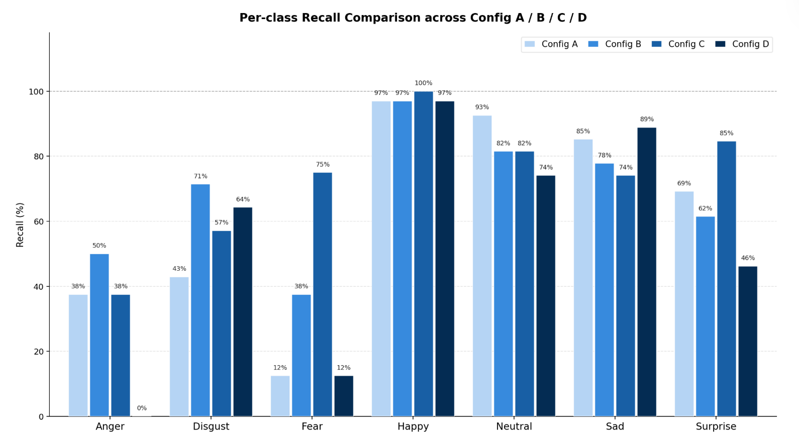
</p>

**Confusion matrices (Config A / B / C / D):**

<p align="center">
  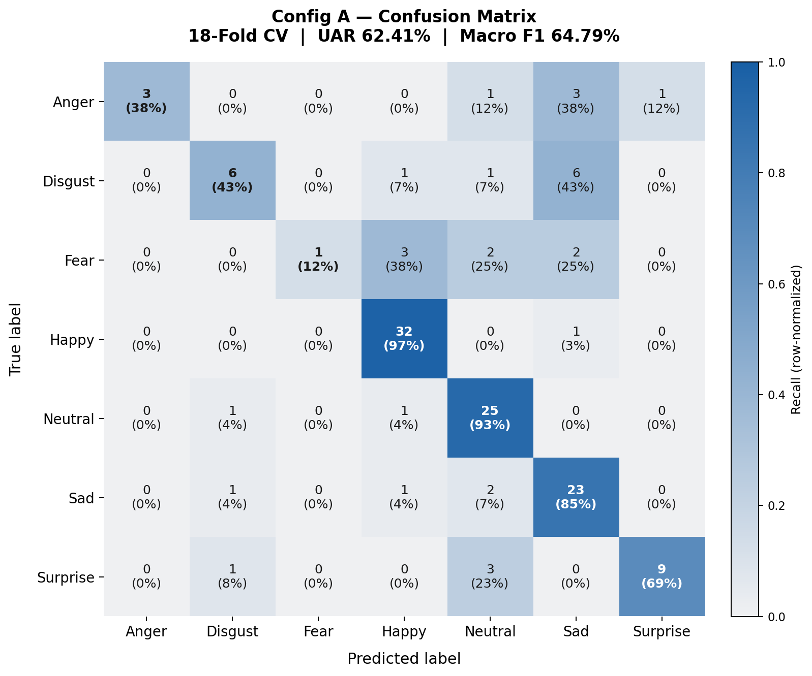
  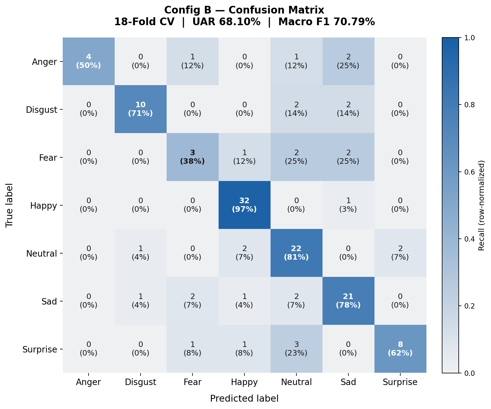
  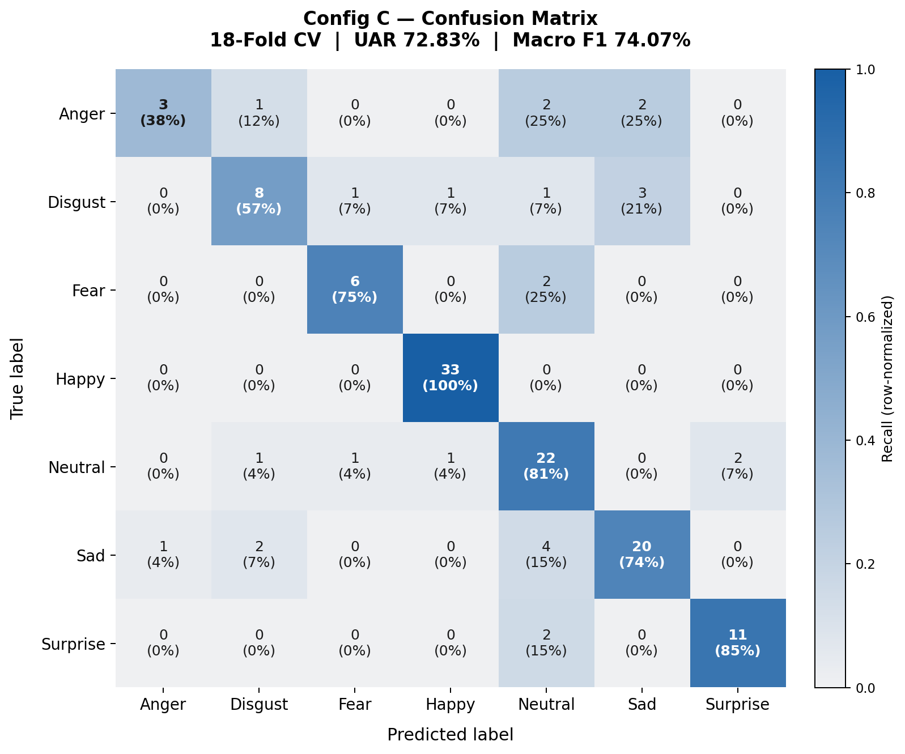
  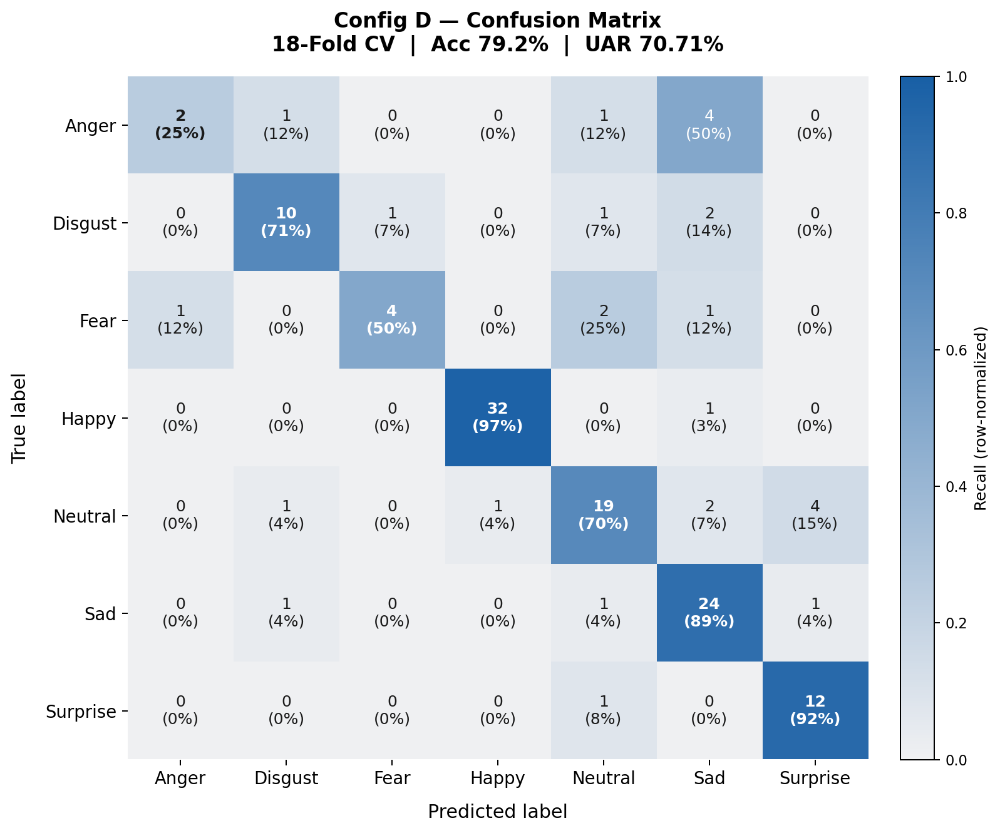
</p>
<p align="center"><em>Config A &nbsp;|&nbsp; Config B &nbsp;|&nbsp; Config C &nbsp;|&nbsp; Config D</em></p>

Two types of recognition failure identified:
- **Localization failure** (Config B, Anger): GradCAM centroid drifts beyond facial landmark distribution
- **Discrimination failure** (Config C, Disgust): attention correctly localized but features insufficient to separate Disgust from Sad

---

### 5. Feature Fusion Strategy Analysis

Explicit geometric features (15 measurements from 68 landmarks) integrated via late fusion and mid cross-attention fusion:

| Configuration | Acc (%) | UAR (%) | Macro F1 (%) | Fusion Method |
|--------------|:---:|:---:|:---:|---|
| Config C (no fusion baseline) | 79.20 | 72.83 | 74.07 | — |
| Fused-HRNet (late fusion) | 70.54 | 54.18 | 52.68 | Late fusion |
| CrossAttn-HRNet-v1 | 73.51 | 58.95 | 61.03 | Mid cross-attention |
| CrossAttn-HRNet-v2 | 73.09 | 58.99 | 60.19 | Mid cross-attention |
| CrossAttn-HRNet-v3 | 77.31 | 66.22 | 68.38 | Mid cross-attention |
| CrossAttn-HRNet + indep supervision | 78.43 | 68.22 | 71.21 | Mid cross-attention |
| Landmark Bias | 76.16 | 63.70 | 66.75 | Attention bias |

> No fusion configuration surpasses the Config C non-fusion baseline, indicating that data scarcity (≈122 training samples/fold) limits the practical benefit of explicit geometric feature integration.

**t-SNE feature distribution (Config C):**

<p align="center">
  
</p>
<p align="center"><em>Left: Ground truth labels &nbsp;|&nbsp; Right: Predicted labels — IR50 final feature space</em></p>

<p align="center">
  
</p>
<p align="center"><em>t-SNE: Landmark Bias configuration</em></p>

---

### 6. Adult vs Infant Misclassification Divergence

| Emotion | Adult Recall | Infant Recall | Domain Distance (d) | Adult Confusion | Infant Confusion |
|---------|:---:|:---:|:---:|---|---|
| Anger | 88.3% | 0.0% | **1.006** | Disgust/Happy/Neutral | **Sad**/Disgust/Happy |
| Fear | 68.9% | 12.0% | **0.733** | **Surprise**/Sad | **Happy**/Neutral/Sad |
| Surprise | 90.6% | 46.0% | 0.507 | — | Happy/Neutral |
| Neutral | 92.1% | 74.0% | 0.205 | — | Disgust/Happy |
| Disgust | 71.9% | 64.0% | 0.446 | Sad/Neutral | **Sad (amplified)** |
| Sad | 92.9% | 89.0% | 0.060 | — | Neutral |
| Happy | 97.2% | 97.0% | 0.031 | — | — |

> Infant Fear manifests as pre-cry state (confused with Sad/Neutral), not Surprise as in adults. Infant Anger collapses to 0% due to underdeveloped facial musculature lacking adult-like brow compression signals. Happy is the only universal category across age groups.

---

## Project Structure

```
POSTER_V2_TIF/
├── main.py                    # Standard POSTER++ training (RAF-DB, AffectNet, CAER-S)
├── main_8.py                  # 8-class AffectNet variant
├── main_config_c.py           # TIF 18-fold LOSO — Config C (HRNet + full IR50)
├── baby_dataset.py            # TIF dataset loader
├── hrnet_landmark_backbone.py # HRNet-R90JT drop-in replacement for MobileFaceNet
├── visualize_features_1.py    # GradCAM, t-SNE, feature visualisation
├── tif_annotated_130.csv      # Full TIF-DB annotations (130 images, 7 classes)
├── requirements.txt
├── models/
│   ├── PosterV2_7cls.py       # POSTER++ with MobileFaceNet landmark backbone
│   ├── PosterV2_7cls_hrnet.py # POSTER++ with HRNet landmark backbone
│   ├── PosterV2_8cls.py       # 8-class variant
│   ├── ir50.py                # IR-50 image backbone
│   ├── vit_model.py           # Window-based cross-attention ViT
│   ├── mobilefacenet.py       # Original adult landmark backbone
│   ├── matrix.py              # Confusion matrix utilities
│   └── pretrain/              # ← Place pretrained weights here
├── splits_18fold_130/         # 18 × (train + test) CSV splits
├── data_preprocessing/
│   └── sam.py                 # SAM optimiser
├── figures/
│   ├── configabcd_per_class.png
│   ├── Facial feature differences between Adult and Infant through landmark/
│   ├── matrix/
│   │   ├── exp01-06/          # Exp01–06 confusion matrices
│   │   ├── exp-ConfigABCD/    # Config A/B/C/D confusion matrices
│   │   └── exp-HRNet-R90JT-LM/ # LM-2, LM-4, LM-6 confusion matrices
│   └── t-SNE visualization/   # Config C and Landmark Bias t-SNE plots
├── checkpoint/                # (git-ignored)
└── log/                       # (git-ignored)
```

---

## Setup

### Requirements

```bash
pip install -r requirements.txt
```

- Python ≥ 3.8, PyTorch 1.8.1 + CUDA 11.1
- [Infant-Facial-Landmark-Detection-and-Tracking](https://github.com/ostadabbas/Infant-Facial-Landmark-Detection-and-Tracking) for HRNet config & weights

### Pretrained Weights

Place under `models/pretrain/`:

| Weight | Download |
|--------|----------|
| `ir50.pth` | [Google Drive](https://drive.google.com/file/d/17QAIPlpZUwkQzOTNiu-gUFLTqAxS-qHt/view?usp=sharing) |
| `mobilefacenet_model_best.pth.tar` | [Google Drive](https://drive.google.com/file/d/1SMYP5NDkmDE3eLlciN7Z4px-bvFEuHEX/view?usp=sharing) |
| `hrnet-r90jt.pth` | [Infant-Facial-Landmark repo](https://github.com/ostadabbas/Infant-Facial-Landmark-Detection-and-Tracking) |

### Data Setup

```
tif_images/
    A02/
        A02F10-JTP-4281AN.jpg
        ...
    A03/
        ...
```

---

## Training

```bash
# TIF 18-fold LOSO — Config C
python main_config_c.py \
    --img_root       /path/to/tif_images \
    --splits_dir     ./splits_18fold_130 \
    --infanface_root /path/to/Infant-Facial-Landmark-Detection-and-Tracking \
    --hrnet_pth      /path/to/hrnet-r90jt.pth \
    --out_dir        ./results_config_c \
    --epochs         50 --batch_size 16 --lr 3.5e-5 --gpu 0

# RAF-DB
python main.py --data /path/to/raf-db --data_type RAF-DB \
               --lr 3.5e-5 --batch-size 144 --epochs 200 --gpu 0
```

---

## Acknowledgements

- **POSTER++** — [Mao et al. (2025), Pattern Recognition](https://github.com/Talented-Q/POSTER_V2)
- **HRNet-R90JT / InfAnFace** — [Ostadabbas et al. (2022), ICPR](https://github.com/ostadabbas/Infant-Facial-Landmark-Detection-and-Tracking)
- **TIF-DB** — [Maack et al. (2017), Frontiers in Psychology](https://doi.org/10.3389/fpsyg.2017.00409)

## Citation

```bibtex
@article{mao2025posterpp,
  title={Poster++: A simpler and stronger facial expression recognition network},
  author={Mao, Jiawei and Xu, Rui and Yin, Xuesong and Chang, Yuanqi and Nie, Binling and Huang, Aibin and Wang, Yibing},
  journal={Pattern Recognition},
  volume={157},
  pages={110951},
  year={2025}
}
```
